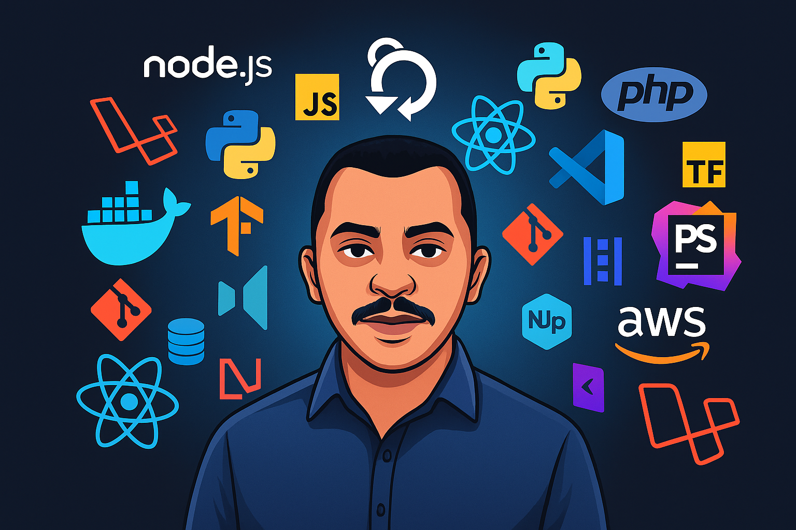

<!-- Banner estilizado com avatar e stacks -->

  

<!-- Saudação animada -->

  

---

### 👨‍💻 Sobre Mim

Sou **Analista e Desenvolvedor de Sistemas**, apaixonado por tecnologia e inovação.  
Atualmente atuo como **Software Engineer Full Stack na Lions Startups**, colaborando com projetos inovadores e de alto impacto.

Tenho experiência no desenvolvimento de aplicações web, análise de dados e soluções inteligentes para ambientes escaláveis.

- 🎯 Foco em resultados, segurança e escalabilidade  
- 🧠 Entusiasta de Machine Learning e Ciência de Dados  
- 🔄 Metodologia Ágil com **SCRUM**  
- ☁️ Em aprendizado contínuo com **AWS**  

---

  
### 🚀 Projetos recentes
| Projeto                    | Descrição                                                                                                        |
| -------------------------- | ---------------------------------------------------------------------------------------------------------------- |
| **Infoconectados**         | Plataforma de conexão entre prestadores e clientes com back-end em PHP nativo e front-end responsivo.            |
| **Vida Exames**            | Sistema de consulta a resultados de exames laboratoriais. Back-end com Laravel, front com Vue.js e Postgress.    |
| **Vida Exames APP**        | Sistema de gestão de exames laboratoriais. Back-end com Laravel, front com Nuxt.js e Postgress.                  |

---

### 💼 Tech Stack

#### 💻 Linguagens & Frameworks  

#### ⚙️ Ferramentas  

#### 📊 Data Science  
  

---

### 📈 GitHub Stats

---

### 🧠 Gráfico de Atividade

---

### 📬 Contato

---

  <strong>“Transformar dados em valor, ideias em soluções.”</strong> 🚀

